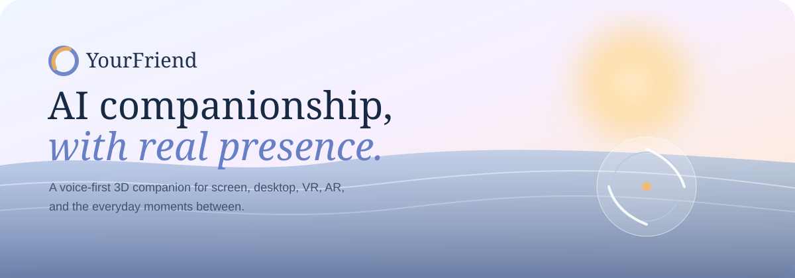
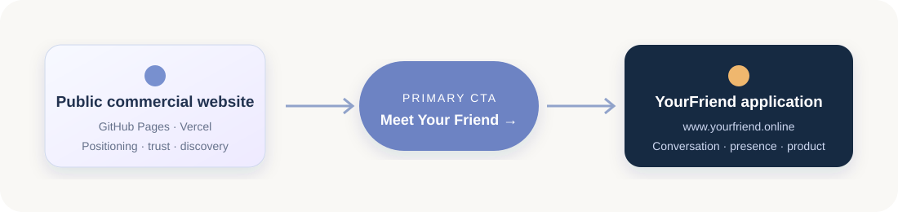
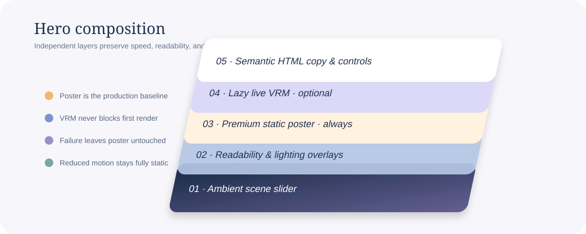

<div align="center">
  

  <br />

  <strong>Premium commercial website for the YourFriend embodied AI companion.</strong><br />
  A calm, accessible acquisition experience that introduces the product and sends visitors to the live application.

  <br /><br />

  [](https://react.dev/)
  [](https://www.typescriptlang.org/)
  [](https://vite.dev/)
  [](https://vitest.dev/)
  [](#licensing)

  <br />

  [**Open YourFriend →**](https://www.yourfriend.online/) · [Product architecture](#product-architecture) · [Run locally](#quick-start) · [Deploy](#deployment)
</div>

---

## Overview

**YourFriend** is positioned as AI companionship with real presence: a voice-first, embodied companion designed for screen-aware assistance, shared media, gaming, desktop, VR, and AR experiences.

This repository contains the **public commercial website**, not the interactive YourFriend application. It is the product presentation, trust, and acquisition layer. Every primary conversion path leads to the separately operated application at [`https://www.yourfriend.online/`](https://www.yourfriend.online/).

### Product promise

> **AI companionship, with real presence.**<br />
> Thoughtful when it helps. Quiet when it should be. Present across the experiences that matter.

| Experience | Commercial story |
|---|---|
| **Watch Together** | Share shows, movies, and videos with a companion that stays in the moment. |
| **Screen Copilot** | Explain, summarize, plan, and work together without turning the screen into a dashboard. |
| **Gaming Co-host** | Context-aware strategy, reactions, and calm companionship during play. |
| **Embodied HomePilot** | Present agent capabilities through a character-led interface for the environment. |

> [!IMPORTANT]
> Product and privacy statements on this website are intentionally restrained. Before a commercial launch, validate all claims against the deployed application and have final privacy and legal copy reviewed by qualified counsel.

## Product architecture

The marketing website and application are deliberately separate concerns:

<p align="center">
  
</p>

```text
PUBLIC COMMERCIAL WEBSITE
GitHub Pages · Vercel · static hosting
        ↓
Premium product presentation
        ↓
Meet Your Friend / Open YourFriend
        ↓
https://www.yourfriend.online/
        ↓
INTERACTIVE YOURFRIEND APPLICATION
```

The marketing frontend does **not** implement authentication, chat, LLM calls, voice recognition, screen capture, memory storage, or HomePilot execution. This separation keeps the public surface fast, cacheable, secure by simplicity, and independently deployable.

## Experience design

The site avoids conventional SaaS-dashboard and cyberpunk patterns. Its visual system combines warm daylight, peaceful evening palettes, measured typography, ambient scenery, and restrained movement.

### Included

- Responsive React, Vite, and TypeScript frontend
- Light, dark, and system themes with persistent user preference
- Five paired light/dark ambient environments
- Slow 24–28 second scene rotation with 3.4–3.8 second opacity crossfades
- Static-first companion presentation with optional, lazy VRM enhancement
- Experiences, presence, privacy, ambient motion, and conversion sections
- Keyboard-accessible navigation, visible focus states, and semantic controls
- `prefers-reduced-motion` behavior and hidden-tab animation suspension
- Frontend-only preview and demo-request flows
- SEO, OpenGraph, Twitter Card, robots, sitemap, manifest, and canonical metadata
- SPA routing and deployment configurations for Vercel and GitHub Pages
- Vitest component and behavior coverage

## Static-first companion

The commercial hero treats the polished static render as the default product experience. Live 3D is a progressive enhancement, never a prerequisite.

<p align="center">
  
</p>

### Runtime sequence

1. Semantic HTML and the first ambient environment render.
2. The theme-aware companion poster paints immediately.
3. Navigation, content, and CTAs are fully usable.
4. On an eligible device, the browser requests the Three.js/VRM chunk during idle time.
5. The poster crossfades only after a valid VRM renders its first frame.
6. Any model, WebGL, or network failure leaves the poster unchanged.

Live VRM eligibility requires all of the following:

- `VITE_ENABLE_LIVE_VRM=true`
- WebGL2 without a major performance caveat
- reduced motion is not requested
- sufficient logical processors and device memory when reported
- a non-mobile/coarse-pointer environment
- a visible hero and visible browser tab

Rendering is capped at 24–30 FPS with a bounded device-pixel ratio. Offscreen and hidden-tab rendering pauses to reduce battery, GPU, and thermal cost.

### Avatar configuration

All model, poster, timing, and performance values are centralized in:

```text
src/config/avatar.ts
```

The optional licensed model belongs at:

```text
public/avatar/models/companion.vrm
```

Launch posters live at:

```text
public/avatar/posters/
├── companion-light.svg
└── companion-dark.svg
```

For the canonical production character, replace these launch assets with transparent AVIF/WebP renders derived from the same commercially licensed VRM. Keep the poster permanently—even after live 3D ships—for first paint, reduced motion, mobile devices, slow networks, screenshots, and WebGL failure recovery.

> [!NOTE]
> The repository does not currently include a licensed production VRM. With live VRM disabled—the default—the website remains complete and usable.

## Ambient scene system

Ambient environments remain independent of the companion layer. The character does not rotate with the background.

| Order | Scene | Light | Dark | Duration | Crossfade |
|---:|---|---|---|---:|---:|
| 01 | Ocean | Sunrise | Moonlight | 24 s | 3.4 s |
| 02 | Mountain lake | Morning | Night | 26 s | 3.6 s |
| 03 | Meditation garden | Day | Night | 28 s | 3.8 s |
| 04 | Coastal terrace | Morning | Twilight | 25 s | 3.4 s |
| 05 | Open sky | Pastel sky | Starlight | 27 s | 3.6 s |

Configuration lives in [`src/config/ambientScenes.ts`](src/config/ambientScenes.ts). Runtime assets live below `public/ambient/light/` and `public/ambient/dark/`; source and art-direction references remain preserved under `docs/reference-images/`.

### Add an ambient scene

1. Export paired, environment-only light and dark images as optimized WebP or AVIF.
2. Place them in `public/ambient/light/` and `public/ambient/dark/`.
3. Add a matching entry to `ambientScenes`:

```ts
{
  id: 'new-scene',
  label: 'New scene',
  lightImage: asset('ambient/light/new-scene.webp'),
  darkImage: asset('ambient/dark/new-scene.webp'),
  duration: 26000,
  transitionDuration: 3600,
  focalPoint: 'center',
}
```

4. Verify light/dark contrast, mobile cropping, reduced motion, and the thumbnail selector.

Do not bake characters, logos, interface controls, or text into rotating environment assets.

## Technology

| Area | Implementation |
|---|---|
| UI | React 19, semantic HTML, component-scoped class conventions |
| Language | TypeScript 5.9 |
| Tooling | Vite 7 |
| Routing | React Router |
| Optional 3D | Three.js and `@pixiv/three-vrm`, dynamically imported |
| Testing | Vitest, Testing Library, jsdom |
| Quality | ESLint, TypeScript project references |
| Hosting | Vercel, GitHub Pages, or any static host with SPA fallback |

## Repository map

```text
yourfriend/
├── .github/workflows/pages.yml    # GitHub Pages CI/CD
├── docs/
│   ├── readme/                    # README SVG artwork and diagrams
│   └── reference-images/          # Preserved art direction and source references
├── public/
│   ├── ambient/{light,dark}/      # Optimized rotating environments
│   ├── avatar/
│   │   ├── posters/               # Always-available static character path
│   │   ├── models/                # Optional licensed companion.vrm
│   │   └── animations/            # Optional curated VRMA clips
│   ├── preview/                   # Product preview media
│   ├── social/                    # OpenGraph/social assets
│   ├── robots.txt
│   └── sitemap.xml
├── src/
│   ├── components/
│   │   ├── ambient/               # Slow scene rotation
│   │   ├── avatar/                # Poster-first / optional live VRM controller
│   │   ├── modals/
│   │   ├── sections/
│   │   └── ui/
│   ├── config/                    # Site, avatar, and ambient configuration
│   ├── hooks/
│   ├── pages/
│   └── styles/
├── tests/
├── index.html
├── vercel.json
└── vite.config.ts
```

## Quick start

### Requirements

- Node.js 22 recommended
- npm 10 or newer

### Install and run

```bash
git clone https://github.com/ruslanmv/yourfriend.git
cd yourfriend
npm install
cp .env.example .env
npm run dev
```

Open the local URL printed by Vite, normally [`http://localhost:5173`](http://localhost:5173).

### Commands

| Command | Purpose |
|---|---|
| `npm run dev` | Start the local Vite development server |
| `npm run build` | Type-check and create the production build in `dist/` |
| `npm run preview` | Serve the production build locally |
| `npm run typecheck` | Run TypeScript project checks |
| `npm run lint` | Run ESLint |
| `npm test` | Run the Vitest suite once |

## Configuration

Copy `.env.example` to `.env`. Never commit credentials or environment-specific secrets.

| Variable | Required | Default | Purpose |
|---|:---:|---|---|
| `VITE_APP_URL` | No | `https://www.yourfriend.online/` | Destination for primary product CTAs |
| `VITE_ENABLE_LIVE_VRM` | No | `false` | Makes live VRM eligible; browser capability checks still apply |
| `VITE_SALES_EMAIL` | No | `hello@yourfriend.online` | `mailto:` fallback for demo requests |
| `VITE_DEMO_ENDPOINT` | No | empty | Optional JSON form endpoint |
| `VITE_SITE_URL` | Production | Pages URL in `.env.production` | Canonical and social metadata origin, with trailing slash |
| `VITE_BASE_PATH` | GitHub Pages | `/` | Vite asset and router base path |

If `VITE_DEMO_ENDPOINT` is configured, it must accept JSON shaped as follows:

```json
{
  "name": "Ada Lovelace",
  "email": "ada@example.com",
  "company": "Example Company",
  "message": "We would like a product walkthrough."
}
```

The repository does not add a marketing backend. Confirm endpoint authentication, abuse prevention, retention, and privacy behavior with the service owner before production use.

## Deployment

### Vercel

1. Import `ruslanmv/yourfriend` into Vercel.
2. Select the **Vite** framework preset.
3. Use `npm run build` as the build command and `dist` as the output directory.
4. Set `VITE_SITE_URL` to the final marketing URL, including the trailing slash.
5. Leave `VITE_BASE_PATH` unset for a root-domain deployment.
6. Deploy.

[`vercel.json`](vercel.json) includes an SPA rewrite so legal and client-side routes work after direct navigation or refresh.

### GitHub Pages

1. Open **Settings → Pages** in the GitHub repository.
2. Select **GitHub Actions** as the source.
3. Push to `main` or manually run **Deploy marketing site to Pages**.
4. The workflow tests, lints, builds, creates the SPA fallback, and publishes `dist/`.

Production URL:

```text
https://ruslanmv.github.io/yourfriend/
```

The Pages workflow builds with:

```bash
VITE_BASE_PATH=/yourfriend/ \
VITE_SITE_URL=https://ruslanmv.github.io/yourfriend/ \
npm run build
```

### Custom domain

When attaching a custom marketing domain:

1. Set `VITE_SITE_URL=https://marketing.example.com/`.
2. Set `VITE_BASE_PATH=/`.
3. Update `public/robots.txt` and `public/sitemap.xml` to the same host.
4. Configure the domain with the selected host.
5. Re-run canonical, OpenGraph, route-refresh, and asset-path checks.

Do not change the application CTA destination unless the production application itself moves.

## Quality and accessibility

Before release, validate:

- [ ] `npm install`, type checking, linting, tests, and production build pass
- [ ] Primary header, hero, and final CTAs open `https://www.yourfriend.online/`
- [ ] Keyboard order and visible focus states are correct
- [ ] Light, dark, and system themes work and explicit preference persists
- [ ] Reduced motion produces a static ambient environment and static companion
- [ ] Hero remains complete with `VITE_ENABLE_LIVE_VRM=false`
- [ ] WebGL and VRM failures leave the poster visible
- [ ] Mobile, tablet, desktop, Safari/iPhone, and low-power devices are checked
- [ ] Background transitions remain slow opacity crossfades
- [ ] Direct navigation and refresh work on deployed legal routes
- [ ] Canonical URL, sitemap, robots, and social image use the production host
- [ ] Lighthouse and Core Web Vitals are measured against the deployed build
- [ ] No secrets, unlicensed media, or unverified security claims are shipped

## Commercial readiness

Before a public campaign or enterprise evaluation:

1. Replace launch media with licensed, optimized production assets.
2. Add a canonical licensed VRM only after performance and identity review.
3. Replace preview placeholders with approved product footage and captions.
4. Obtain counsel-approved Privacy Policy and Terms of Use.
5. Verify privacy, capture, memory, and security statements against real behavior.
6. Connect a production demo endpoint or monitored sales mailbox.
7. Establish analytics consent, data minimization, and retention decisions before adding telemetry.
8. Run accessibility, device, browser, performance, and failure-mode reviews.
9. Review incident ownership, deployment rollback, and content-approval processes.

## Content and media governance

- Preserve source/reference art in `docs/reference-images/`; add new work rather than deleting useful history.
- Serve optimized assets from `public/`, not multi-megabyte source files where avoidable.
- Keep ambient environments and the canonical companion as separate visual layers.
- Document model, font, music, video, and image licenses before commercial publication.
- Do not commit `.env`, API keys, credentials, private endpoints, customer data, or proprietary model files without explicit approval.

## Contributing

1. Create a focused branch.
2. Keep changes additive and avoid modifying unrelated product integrations.
3. Run the complete quality suite:

```bash
npm run typecheck
npm run lint
npm test
npm run build
```

4. Include screenshots for perceptible UI changes.
5. Explain accessibility, performance, content, and deployment implications in the pull request.

## Licensing

No repository-wide software or media license is currently declared. Until the owner adds explicit license terms, treat the source code, generated references, companion imagery, models, animations, video, fonts, and brand assets as **all rights reserved** and unavailable for redistribution or commercial reuse without permission.

Third-party dependencies remain subject to their respective licenses.

## Contact

- **Product application:** [`https://www.yourfriend.online/`](https://www.yourfriend.online/)
- **Repository:** [`https://github.com/ruslanmv/yourfriend`](https://github.com/ruslanmv/yourfriend)
- **Commercial inquiries:** [`hello@yourfriend.online`](mailto:hello@yourfriend.online)

---

Two additional companion-only concept artworks (light mountain interior and dark rooftop city night) were added under `docs/reference-images/companion-integrated/` and included in the ZIP.

### Vercel (marketing site)

1. Import this repository in Vercel and select the Vite framework preset.
2. Keep the build command as `npm run build` and output directory as `dist` (also declared in `vercel.json`).
3. Set `VITE_SITE_URL` to the final marketing-site URL, including its trailing slash. Leave `VITE_BASE_PATH` unset for a root-domain deployment.
4. Deploy. The included rewrite keeps direct SPA route refreshes working.

### GitHub Pages

1. In **Settings → Pages**, choose **GitHub Actions** as the source.
2. Push to `main` or run **Deploy marketing site to Pages** manually.
3. The workflow builds with `VITE_BASE_PATH=/yourfriend/` and deploys `dist` to `https://ruslanmv.github.io/yourfriend/`.

For a future custom domain, change `VITE_SITE_URL`, set `VITE_BASE_PATH=/`, and update `public/robots.txt` and `public/sitemap.xml` to the same canonical host.
